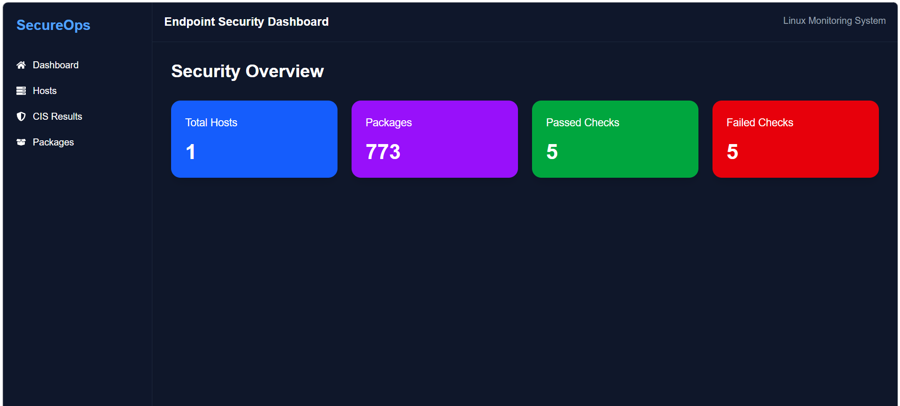
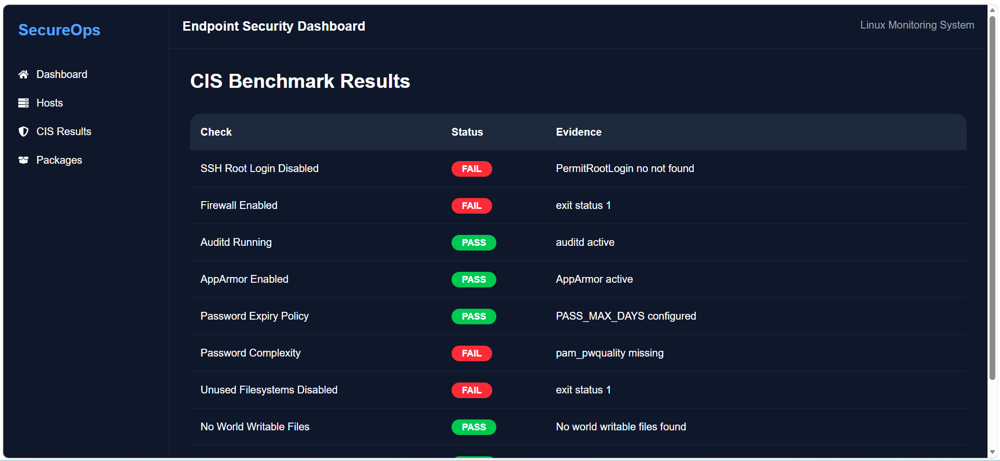
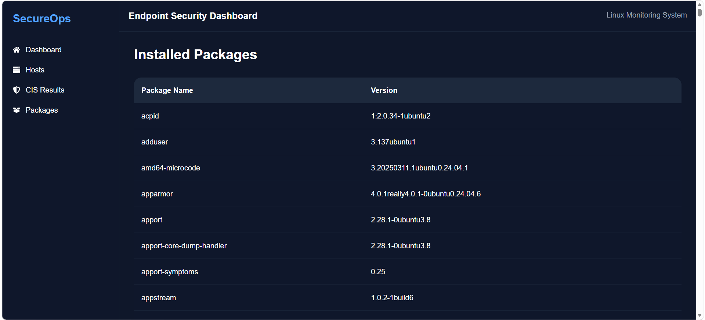

# SecureOps - Endpoint Security Monitoring Platform

## Overview

SecureOps is a lightweight Endpoint Security Monitoring Platform designed to monitor Linux endpoints, collect security information, and display the results through a centralized web dashboard.

The platform consists of three major components:

- Linux Agent (Go)
- Backend API (Node.js + Express + MongoDB)
- Frontend Dashboard (React + Tailwind CSS)

The Linux agent collects host information, installed packages, and CIS benchmark results from Linux systems and sends them to the backend. The backend stores the data in MongoDB and provides APIs for the frontend dashboard.

---

## Features

### Host Monitoring

- Collect hostname information
- Detect operating system details
- Capture IP address information
- Maintain centralized host inventory

### Package Monitoring

- Collect installed packages
- Display package versions
- Track software inventory

### CIS Benchmark Checks

- SSH Root Login Check
- Password Policy Check
- Firewall Status Check
- Additional CIS Benchmark validations

### Dashboard

- Total Hosts
- Installed Packages
- Passed Security Checks
- Failed Security Checks
- Security Overview

---

## System Architecture

```text
+----------------+
| Linux Agent    |
| (Go)           |
+--------+-------+
         |
         | HTTP POST
         v
+----------------+
| Backend API    |
| Node.js        |
| Express.js     |
+--------+-------+
         |
         | Mongoose
         v
+----------------+
| MongoDB Atlas  |
+--------+-------+
         |
         | REST APIs
         v
+----------------+
| React Dashboard|
| Tailwind CSS   |
+----------------+
```

---

## Project Structure

```text
secureOps/
│
├── frontend/
│   ├── public/
│   ├── src/
│   ├── package.json
│   └── ...
│
├── backend/
│   ├── controllers/
│   ├── models/
│   ├── routes/
│   ├── middleware/
│   ├── app.js
│   └── ...
│
├── linux-agent/
│   ├── checks/
│   ├── collector/
│   ├── reporter/
│   ├── main.go
│   └── ...
│
└── README.md
```

---

## Tech Stack

### Frontend

- React
- React Router DOM
- Axios
- Tailwind CSS
- React Icons

### Backend

- Node.js
- Express.js
- MongoDB
- Mongoose

### Agent

- Go (Golang)

### Infrastructure

- AWS EC2
- Ubuntu Server

---

## Backend Setup

### Install Dependencies

```bash
npm install
```

### Create Environment Variables

Create a `.env` file:

```env
PORT=5000
MONGO_URI=your_mongodb_connection_string
```

### Start Backend

```bash
npm run dev
```

or

```bash
node app.js
```

---

## Frontend Setup

### Install Dependencies

```bash
npm install
```

### Start Frontend

```bash
npm run dev
```

Frontend will be available at:

```text
http://localhost:5173
```

---

## Linux Agent Setup

### Initialize Dependencies

```bash
go mod tidy
```

### Run Agent

```bash
go run main.go
```

### Build Agent

```bash
go build
```

### Execute Binary

```bash
./linux-agent
```

---

## API Endpoints

### Submit Endpoint Report

```http
POST /api/agent/report
```

### Get Hosts

```http
GET /api/hosts
```

### Get Installed Packages

```http
GET /api/packages
```

### Get CIS Results

```http
GET /api/cis-results
```

---

## Sample Report Payload

```json
{
  "hostname": "ubuntu-server",
  "os": "Ubuntu 22.04",
  "ipAddress": "17x.3x.2x.2xx",
  "packages": [
    {
      "name": "nginx",
      "version": "1.18.0"
    }
  ],
  "checks": [
    {
      "checkName": "SSH Root Login",
      "status": "PASS",
      "evidence": "PermitRootLogin no"
    }
  ]
}
```

---

## Security Checks Included

- SSH Root Login
- Password Expiry Policy
- Firewall Status
- User Account Validation
- CIS Benchmark Compliance Checks
- And many more

---

## Deployment

### Backend

- AWS EC2
- Ubuntu Server
- Node.js

### Database

- MongoDB Atlas

### Frontend

- Vercel
- Netlify
- AWS EC2

---

## Future Enhancements

- Historical Scan Reports
- Real-Time Monitoring
- Vulnerability Scanning
- Email Notifications
- Authentication & Authorization
- Role-Based Access Control
- Compliance Reporting
- Security Score Dashboard
- Scheduled Agent Reporting

---

## Screenshots

Screenshots of project:

### Dashboard


### CisResult


### Packages Page


---

## Author

**Rahul Patel**

Built using Go, Node.js, Express.js, MongoDB, React, Tailwind CSS, and AWS EC2.

---

## License

This project is intended for educational and learning purposes.
